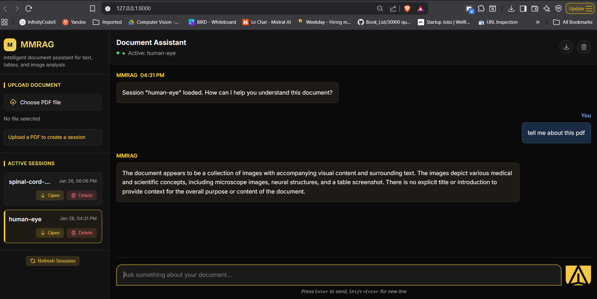

# MultiModel-RAG 

# MultiModel-RAG Architecture Flow
                        +---------------------+
                        |   User Interaction   |
                        | (Frontend UI in HTML)|
                        +----------+----------+
                                   |
                                   v
                        +---------------------+
                        |   FastAPI Backend   |
                        |   (app/api routes)  |
                        +----------+----------+
                                   |
                                   |
                  +----------------+----------------+
                  |                                 |
                  v                                 v
         +------------------+            +----------------------+
         |   Text Ingestion |            |   Image Ingestion     |
         | (parse uploaded  |            | (parse user images)   |
         |    text files)   |            |                      |
         +--------+---------+            +----------+-----------+
                  |                                   |
                  v                                   v
       +----------------------+           +-----------------------+
       |  Text Embeddings     |           |   Image Embeddings    |
       | (sentence/embed text)|           |   (CLIP or visual)    |
       +-----------+----------+           +-----------+-----------+
                   |                                  |
                   v                                  v
            +-----------------------------------------------+
            |                Vector Store (ChromaDB)         |
            |   (store & index text + image vectors)         |
            +------------------+----------------------------+
                               |
                               v
                  +-------------------------------+
                  |         Retriever Module      |
                  |  (search by query similarity) |
                  +---------------+---------------+
                                  |
                                  v
                     +---------------------------+
                     |      LLM Client Module    |
                     |  (Llama 3.1 8B via Ollama)|
                     +-------------+-------------+
                                   |
                                   v
                      +-------------------------+
                      |   Generated Answer      |
                      |  (RAG Response to User) |
                      +-------------------------+
                                   |
                                   v
                          +-----------------+
                          | Frontend Output |
                          +-----------------+
